# RE CODE 👾

<p align="center">
  <a href="https://github.com/mangiapanejohn-dev/-Re-Code/stargazers">
    
  </a>
  <a href="https://github.com/mangiapanejohn-dev/-Re-Code/forks">
    
  </a>
  
  
  <a href="LICENSE">
    
  </a>
</p>

<p align="center">
  <strong>
    <a href="README.md">English</a> | 
    <a href="README_CN.md">中文</a>
  </strong>
</p>

---

## What is RE CODE?

**RE CODE** is an open-source Claude API client designed to solve the Claude account ban problem.

### Why Claude Gets Banned

Claude has an internal monitoring system codenamed **"Tango Tengu"** that collects:

| Monitoring Dimension | Data Collected |
|:---|:---|
| Behavior Data | Every action: file operations, command execution |
| Device Fingerprinting | 40+ dimensions of device information |
| User Tracking | Users assigned to 30 "buckets" for tracking |

### Ban Trigger Conditions

| Risk Level | Trigger |
|:---:|:---|
| Critical | Shared accounts, third-party clients |
| High | API rate limiting violations |
| Medium | Frequent IP geo-hopping, mismatched payment info |

---

## RE CODE Advantages - Solve Claude Ban Issue

| Feature | Description |
|:---|:---|
| **Anti-Ban** | Hide device fingerprint, bypass Tango Tengu monitoring |
| **Privacy** | Disable telemetry, full data control |
| **Custom Endpoints** | Self-hosted proxy support, hide real IP |
| **Stable** | Dedicated infrastructure, avoid rate limit triggers |
| **Flexible** | Custom API endpoints and models |
| **Cross-Platform** | Windows / macOS / Linux / Termux |

---

## Architecture & Flow

### Request Processing Flow

```mermaid
sequenceDiagram
    participant USER as User
    participant CLI as CLI/TUI
    participant ENGINE as Client Engine
    participant SEC as Security Pipeline
    participant PROXY as Proxy Network
    participant GATEWAY as API Gateway
    participant API as Anthropic Claude API
    
    USER->>CLI: User Input Query
    CLI->>ENGINE: Parse User Input
    ENGINE->>ENGINE: Validate Input
    ENGINE->>ENGINE: Build Context
    ENGINE->>ENGINE: Queue Request
    
    ENGINE->>SEC: Raw Request
    
    Note over SEC: Security Pipeline - 4 Layers
    
    SEC->>SEC: [Layer 1] Device Identity Obfuscation
    SEC->>SEC:   - MAC Address Rotation
    SEC->>SEC:   - Hardware UUID Spoofing
    SEC->>SEC:   - Display Info Noise Injection
    SEC->>SEC:   - Timezone Normalization
    SEC->>SEC:   - User-Agent Rotation
    
    SEC->>SEC: [Layer 2] Request Pattern Randomization
    SEC->>SEC:   - Request Timing Randomization
    SEC->>SEC:   - Token Sequence Permutation
    SEC->>SEC:   - Payload Size Padding
    SEC->>SEC:   - Header Sanitization
    SEC->>SEC:   - Cookie Isolation
    
    SEC->>SEC: [Layer 3] Network Identity Management
    SEC->>SEC:   - Select from Residential IP Pool
    SEC->>SEC:   - Enforce Geo-Location Consistency
    SEC->>SEC:   - Check IP Reputation Score
    SEC->>SEC:   - Automatic IP Rotation
    SEC->>SEC:   - Smart Failover
    
    SEC->>SEC: [Layer 4] API Key Protection
    SEC->>SEC:   - Load from Local Encryption
    SEC->>SEC:   - Store in Memory-Only
    SEC->>SEC:   - Process Isolation
    SEC->>SEC:   - Key Rotation Support
    SEC->>SEC:   - Never Expose to Third-Party
    
    SEC->>SEC: AES-256 Encryption
    SEC->>SEC: HMAC Signature Generation
    SEC->>SEC: Payload Compression
    
    SEC->>PROXY: Encrypted & Signed Request
    
    Note over PROXY: Proxy Network Processing
    PROXY->>PROXY: Global Load Balancing
    PROXY->>PROXY: Edge Node Selection
    PROXY->>PROXY: Request Obfuscation
    PROXY->>PROXY: Fingerprint Randomization
    PROXY->>PROXY: Exit Node Selection (Residential IP)
    PROXY->>PROXY: Geographic Consistency Check
    
    PROXY->>GATEWAY: Routed Request
    
    Note over GATEWAY: API Gateway Processing
    GATEWAY->>GATEWAY: Rate Limiting Check
    GATEWAY->>GATEWAY: Request Validation
    GATEWAY->>GATEWAY: Retry Engine Init
    GATEWAY->>GATEWAY: Failover Controller Ready
    
    GATEWAY->>API: Forward to Claude API
    
    alt Success Response
        API->>GATEWAY: Claude Response (200 OK)
        GATEWAY->>PROXY: Response Data
        PROXY->>SEC: Encrypted Response
        SEC->>SEC: Decrypt Response
        SEC->>SEC: Verify HMAC
        SEC->>SEC: Decompress Payload
        SEC->>ENGINE: Parsed Response
        ENGINE->>ENGINE: Update Context Cache
        ENGINE->>ENGINE: Format Output
        ENGINE->>CLI: Display Result
        CLI->>USER: Output to User
    else Rate Limit Error
        API->>GATEWAY: 429 Too Many Requests
        GATEWAY->>PROXY: Trigger Retry Mechanism
        PROXY->>PROXY: Switch to Different Exit Node
        PROXY->>PROXY: Select New Residential IP
        PROXY->>PROXY: Update IP Reputation Score
        PROXY->>GATEWAY: Retry with New IP
        GATEWAY->>API: Retry Request
    else Ban Risk Detected
        API->>GATEWAY: 403 Forbidden
        GATEWAY->>PROXY: Emergency IP Rotation
        PROXY->>PROXY: Select from Backup IP Pool
        PROXY->>GATEWAY: Emergency Retry
        GATEWAY->>API: Retry with New Identity
    end
```



### Core Components
    L3->>L3: Select from Residential IP Pool
    L3->>L3: Enforce Geo-Location Consistency
    L3->>L3: Check IP Reputation Score
    L3->>L3: Automatic IP Rotation
    L3->>L3: Smart Failover if Needed
    L3->>L4: Network-Identity Request
    
    %% Security Layer 4: API Key Protection
    Note over L4: API Key Protection
    L4->>L4: Load from Local Encryption
    L4->>L4: Store in Memory-Only
    L4->>L4: Process Isolation
    L4->>L4: Key Rotation Support
    L4->>L4: Never Expose to Third-Party
    L4->>TUNNEL: Security-Protected Request
    
    %% Security Tunnel Processing
    Note over TUNNEL: Security Tunnel
    TUNNEL->>TUNNEL: AES-256 Encryption
    TUNNEL->>TUNNEL: Payload Compression
    TUNNEL->>TUNNEL: HMAC Signature
    TUNNEL->>TUNNEL: Timing Randomization
    TUNNEL->>PROXY: Encrypted Forward Request
    
    %% Proxy Infrastructure Processing
    Note over PROXY: Proxy Infrastructure
    PROXY->>PROXY: Global Load Balancing
    PROXY->>PROXY: Edge Node Selection
    PROXY->>PROXY: Request Obfuscation
    PROXY->>PROXY: Fingerprint Randomization
    PROXY->>PROXY: Exit Node Selection
    PROXY->>GATEWAY: Routed Request
    
    %% API Gateway Processing
    Note over GATEWAY: API Gateway
    GATEWAY->>GATEWAY: Rate Limiting
    GATEWAY->>GATEWAY: Retry Engine
    GATEWAY->>GATEWAY: Failover Controller
    GATEWAY->>API: Forward to Claude API
    
    %% Response Phase
    alt Success Response
        API->>GATEWAY: Claude Response
        GATEWAY->>PROXY: Response Data
        PROXY->>TUNNEL: Encrypted Response
        TUNNEL->>TUNNEL: Decrypt Response
        TUNNEL->>ENGINE: Parsed Response
        ENGINE->>ENGINE: Update Context Cache
        ENGINE->>CLI: Display Result
        CLI->>USER: Output
    else Rate Limit / Ban Risk
        API->>GATEWAY: Rate Limit Error
        GATEWAY->>PROXY: Trigger Retry
        PROXY->>PROXY: Switch Exit Node
        PROXY->>GATEWAY: Retry with New IP
        GATEWAY->>API: Retry Request
    end
```

### Core Components

| Component | Function | Technology |
|:---|:---|:---|
| **Client Engine** | User interaction, command parsing, context management | React + Node.js |
| **Security Pipeline** | 4-layer security (Device/Pattern/Network/Key) + AES-256 + HMAC | Custom middleware |
| **Proxy Network** | Load balance, residential IP pool, edge nodes, failover | Dynamic node management |
| **API Gateway** | Rate limiting, retry engine, failover, request validation | Nginx + Lua scripts |

---

## Quick Install

### macOS / Linux
```bash
curl -fsSL https://cdn.jsdelivr.net/gh/mangiapanejohn-dev/-Re-Code/install.sh | bash
```

### Windows (PowerShell)
```powershell
irm -useb https://cdn.jsdelivr.net/gh/mangiapanejohn-dev/-Re-Code/install.ps1 | iex
```

### Termux
```bash
curl -fsSL https://cdn.jsdelivr.net/gh/mangiapanejohn-dev/-Re-Code/install-termux.sh | bash
```

---

## Privacy Configuration

```bash
# Disable telemetry (reduce data collection)
export DISABLE_TELEMETRY=1

# Use custom API endpoint
export ANTHROPIC_BASE_URL=https://your-proxy.com

# Use your own API key
export ANTHROPIC_API_KEY=sk-xxx
```

---

## Usage

| Command | Description |
|:---|:---|
| `recode` | Start RE CODE |
| `recode -v` | Show version |
| `/model [name]` | Switch model (opus/sonnet/haiku) |
| `/config` | View/edit configuration |
| `/clear` | Clear session |
| `/exit` | Exit |

---

## Project Structure

```
ReCode/
├── src/                    # Source code
│   ├── commands/           # CLI commands
│   ├── components/         # UI components
│   ├── utils/              # Utilities
│   └── tools/              # Built-in tools
├── recode-temp/package/   # Packaged CLI
├── install.sh              # macOS/Linux installer
├── install.ps1             # Windows installer
├── install-termux.sh       # Termux installer
└── README.md               # This file
```

---

## Contributing

```bash
git clone https://github.com/mangiapanejohn-dev/-Re-Code.git
cd ReCode
git checkout -b feature/your-feature
git commit -m 'Add awesome feature'
git push origin feature/your-feature
```

---

## License

MIT License - See [LICENSE](LICENSE)

---

<p align="center">
  Made with by <a href="https://github.com/mangiapanejohn-dev">ReCode Team</a>
</p>