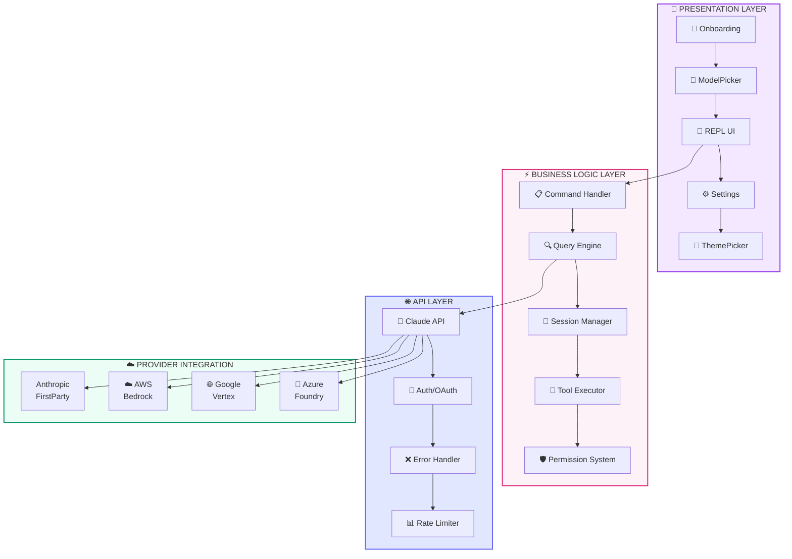
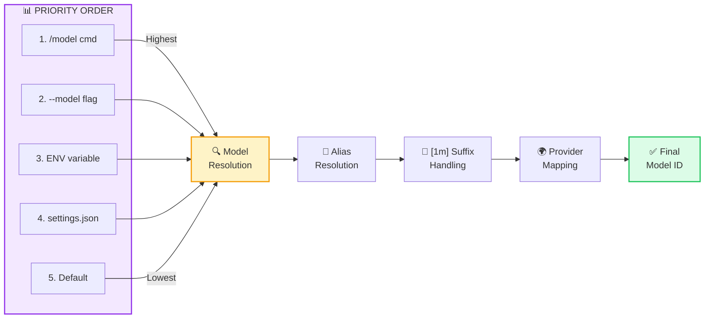
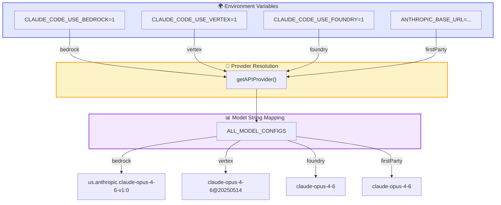
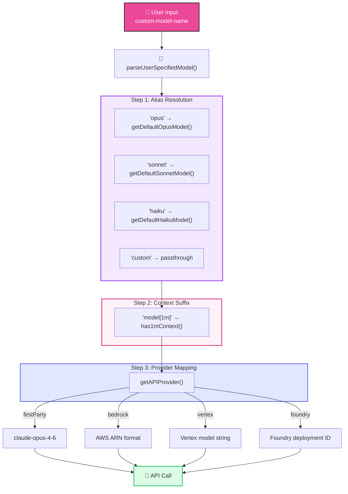
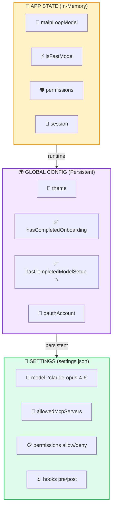
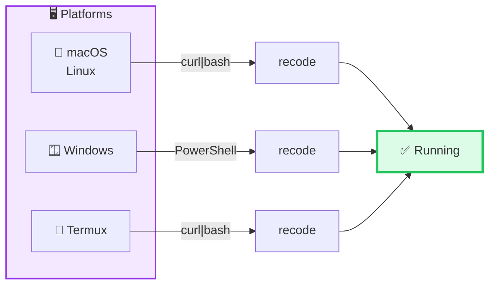
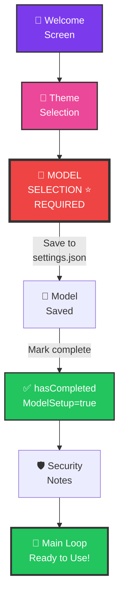
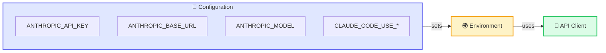

# ReCode 🚀

<p align="center">
  
  
  
  
</p>

> **ReCode** — A powerful code agent—writing code is just the basics!

---

## 🔥 Why ReCode?

| Feature | Description |
|---------|-------------|
| 🤖 **Multi-Model Support** | Claude Opus/Sonnet/Haiku, custom models, any OpenAI-compatible API |
| 🔧 **Highly Configurable** | Model selection, API endpoints, environment variables |
| 🌍 **Provider Agnostic** | Anthropic API, AWS Bedrock, Google Vertex, Azure Foundry |
| 💻 **Cross-Platform** | Windows, macOS, Linux, Termux |
| 🛡️ **Enterprise-Grade** | Permission system, workspace trust, MCP approval |
| ⚡ **Zero Dependencies** | Terminal-based, instant startup |

---

## 🏗️ Architecture Overview



---

## 🔄 Core Workflow

```mermaid
flowchart TB
    START["🚀 CLI Entry<br/>cli.js"] --> BOOT["⚙️ Bootstrap<br/>& Config Load"]
    BOOT --> CHECK{"📋 Configuration<br/>Check"}

    CHECK -->|"First Launch"| ONBOARD["📝 Onboarding<br/>Wizard"]
    CHECK -->|"Already Configured"| MAIN["💬 Main Loop<br/>REPL UI"]

    ONBOARD --> THEME["🎨 Theme<br/>Selection"]
    THEME --> MODEL["🤖 Model<br/>Configuration<br/>⭐ REQUIRED]
    MODEL --> SECURITY["🛡️ Security<br/>Notes"]
    SECURITY --> MAIN

    MODEL -.->|"Save to<br/>settings.json"| CONFIG["💾 Settings<br/>Persisted"]
    MODEL -.->|"Mark complete"| GLOB["🌍 Global Config<br/>hasCompletedModelSetup"]

    style START fill:#7c3aed,stroke:#333,stroke-width:2,color:#fff
    style CHECK fill:#f59e0b,stroke:#333,stroke-width:2,color:#000
    style ONBOARD fill:#ec4899,stroke:#333,stroke-width:2,color:#fff
    style MODEL fill:#ef4444,stroke:#333,stroke-width:3,color:#fff
    style MAIN fill:#22c55e,stroke:#333,stroke-width:2,color:#fff
```

---

## 🔧 Model Configuration System



### Model Selection Priority

| Priority | Source | Example |
|----------|--------|---------|
| 1 | `/model` command | `/model opus` |
| 2 | CLI `--model` flag | `--model sonnet` |
| 3 | ENV variable | `ANTHROPIC_MODEL=haiku` |
| 4 | `settings.json` | `{ "model": "claude-opus-4-6" }` |
| 5 | Built-in default | Sonnet 4.6 |

---

## 🌍 Custom Model & Provider Configuration



---

## 🔬 Custom Model Configuration Flow



---

## 📊 State Management Architecture



---

## 📦 Installation

### One-Click Installation



| Platform | Command |
|----------|---------|
| **macOS / Linux** | `curl -sL https://raw.githubusercontent.com/mangiapanejohn-dev/-Re-Code/main/install.sh \| bash` |
| **Windows** | `irm https://raw.githubusercontent.com/mangiapanejohn-dev/-Re-Code/main/install.ps1 \| iex` |
| **Termux** | `curl -sL https://raw.githubusercontent.com/mangiapanejohn-dev/-Re-Code/main/install-termux.sh \| bash` |

### NPM Installation

```bash
npm install -g @recode/cli
recode
```

---

## 💻 First Launch Flow



### Environment Variables



```bash
# API Configuration
ANTHROPIC_API_KEY=your-key          # API authentication
ANTHROPIC_BASE_URL=custom-endpoint  # Custom API URL
ANTHROPIC_MODEL=model-name          # Specify model

# Provider Selection
CLAUDE_CODE_USE_BEDROCK=1           # Use AWS Bedrock
CLAUDE_CODE_USE_VERTEX=1             # Use Google Vertex
CLAUDE_CODE_USE_FOUNDRY=1            # Use Azure Foundry
```

---

## Commands

| Command | Description |
|---------|-------------|
| `/help` | Display help information |
| `/model` | Switch AI model |
| `/config` | View/modify configuration |
| `/clear` | Clear current session |
| `/exit` | Exit program |

---

## 🗂️ Project Structure

```
ReCode/
├── src/
│   ├── components/              # React UI components
│   │   ├── Onboarding.tsx       # First-launch wizard
│   │   ├── ModelPicker.tsx      # Model selection UI
│   │   └── REPL.tsx            # Main chat interface
│   ├── services/api/            # API client layer
│   ├── utils/
│   │   ├── model/               # Model configuration
│   │   │   ├── model.ts         # Model selection logic
│   │   │   ├── configs.ts       # Model configs
│   │   │   ├── providers.ts     # Provider resolution
│   │   │   └── validateModel.ts
│   │   ├── settings/            # User preferences
│   │   └── config.ts           # Global config
│   └── commands/                # CLI commands
├── recode-temp/package/         # NPM package
├── install.sh                   # macOS/Linux installer
├── install.ps1                  # Windows installer
├── install-termux.sh            # Termux installer
└── README.md
```

---

## 🤝 Contributing

```bash
# Fork the repository
git clone https://github.com/mangiapanejohn-dev/-Re-Code.git

# Create your feature branch
git checkout -b feature/amazing

# Commit your changes
git commit -m 'Add amazing feature'

# Push to the branch
git push origin feature/amazing
```

---

## 📜 License

MIT License - See [LICENSE](LICENSE) for details.

---

<p align="center">Made with ❤️ by ReCode Team</p>
