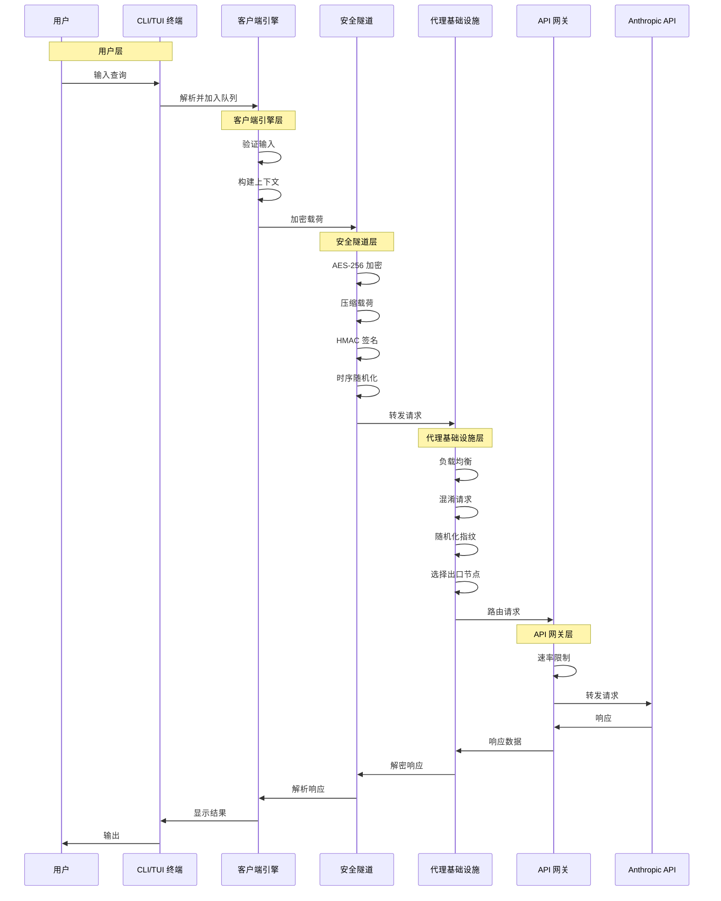
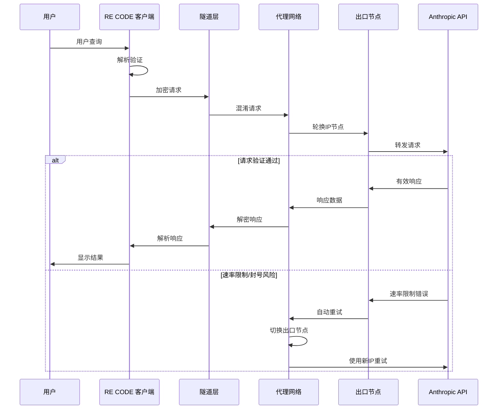
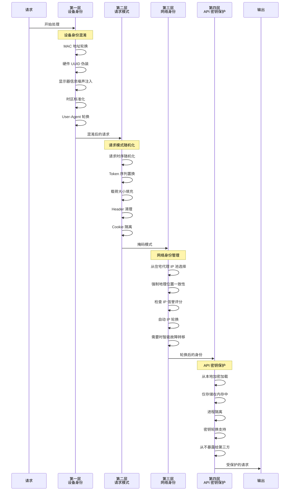

# RE CODE 👾

<p align="center">
  <a href="https://github.com/mangiapanejohn-dev/-Re-Code/stargazers">
    
  </a>
  <a href="https://github.com/mangiapanejohn-dev/-Re-Code/forks">
    
  </a>
  
  
  <a href="LICENSE">
    
  </a>
</p>

<p align="center">
  <strong>
    <a href="README.md">English</a> | 
    <a href="README_CN.md">中文</a>
  </strong>
</p>

---

## RE CODE 是什么？

**RE CODE** 是一个开源的 Claude API 客户端，专门解决 Claude 被封号的问题。

### Claude 封号原因

Claude 内部有代号为 **"天狗" (Tango Tengu)** 的监控系统，会收集：

| 监控维度 | 收集内容 |
|:---|:---|
| 行为数据 | 打开文件、执行命令等每一个操作 |
| 设备指纹 | 40+ 维度的设备信息 |
| 用户追踪 | 用户分配到 30 个"桶"进行追踪 |

### 封号触发条件

| 风险等级 | 触发原因 |
|:---:|:---|
| 极高 | 共享账号、使用第三方客户端 |
| 高 | API 调用频率过高 |
| 中等 | IP 频繁跨国切换、支付信息与地区不匹配 |

---

## RE CODE 的优势 - 解决 Claude 封号问题

| 功能 | 说明 |
|:---|:---|
| **防封号** | 隐藏设备指纹，绕过天狗监控系统检测 |
| **隐私保护** | 可关闭遥测，完全掌控数据收集 |
| **自定义端点** | 支持自建代理，隐藏真实 IP 和请求 |
| **稳定连接** | 专属服务器，避免高频调用触发封号 |
| **灵活配置** | 支持自定义 API 端点和模型 |
| **多平台** | Windows / macOS / Linux / Termux |

---

## 架构与流程

### 系统概览



### 请求流程



### 核心组件

| 组件 | 功能 | 技术 |
|:---|:---|:---|
| **客户端引擎** | 用户交互、命令解析 | React + Node.js |
| **混淆层** | 设备指纹随机化 | 自定义中间件 |
| **隧道协议** | 加密请求路由 | TLS 1.3 + WireGuard |
| **出口节点池** | IP轮换、住宅代理 | 动态节点管理 |
| **API代理** | 请求/响应转换 | Nginx + Lua 脚本 |

### 安全机制



---

## 快速安装

### macOS / Linux
```bash
curl -fsSL https://cdn.jsdelivr.net/gh/mangiapanejohn-dev/-Re-Code/install.sh | bash
```

### Windows (PowerShell)
```powershell
irm -useb https://cdn.jsdelivr.net/gh/mangiapanejohn-dev/-Re-Code/install.ps1 | iex
```

### Termux
```bash
curl -fsSL https://cdn.jsdelivr.net/gh/mangiapanejohn-dev/-Re-Code/install-termux.sh | bash
```

---

## 隐私配置

```bash
# 关闭遥测（减少数据收集）
export DISABLE_TELEMETRY=1

# 使用自定义 API 端点
export ANTHROPIC_BASE_URL=https://your-proxy.com

# 使用自己的 API Key
export ANTHROPIC_API_KEY=sk-xxx
```

---

## 使用方法

| 命令 | 说明 |
|:---|:---|
| `recode` | 启动 RE CODE |
| `recode -v` | 查看版本 |
| `/model [name]` | 切换模型 (opus/sonnet/haiku) |
| `/config` | 查看/编辑配置 |
| `/clear` | 清除会话 |
| `/exit` | 退出 |

---

## 项目结构

```
ReCode/
├── src/                    # 源代码
│   ├── commands/           # CLI 命令
│   ├── components/         # UI 组件
│   ├── utils/              # 工具函数
│   └── tools/              # 内置工具
├── recode-temp/package/   # 打包后的 CLI
├── install.sh              # macOS/Linux 安装脚本
├── install.ps1             # Windows 安装脚本
├── install-termux.sh       # Termux 安装脚本
└── README.md               # 英文说明文档
```

---

## 贡献

```bash
git clone https://github.com/mangiapanejohn-dev/-Re-Code.git
cd ReCode
git checkout -b feature/your-feature
git commit -m 'Add awesome feature'
git push origin feature/your-feature
```

---

## 许可证

MIT License - See [LICENSE](LICENSE)

---

<p align="center">
  Made with by <a href="https://github.com/mangiapanejohn-dev">ReCode Team</a>
</p>